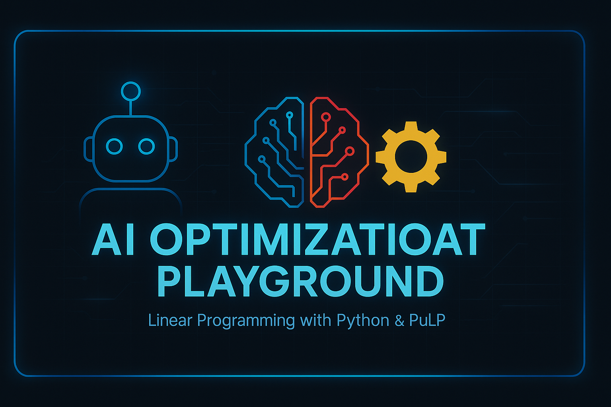

# 🤖 AI Optimization Playground

This repository is a growing collection of optimization models and scenarios built using [PuLP](https://github.com/coin-or/pulp) and Python.

Each notebook solves a real-world **linear programming (LP)** problem, including:
- ✅ Profit maximization
- 🔻 Cost minimization
- 🔄 What-if scenario testing
- 🎛️ Interactive controls via ipywidgets
- 📦 Visual charts of LP solutions

---

## 📂 Contents

| Notebook | Description |
|----------|-------------|
| `optimization_scenarios.ipynb` | Master template with dropdown inputs, visual charts, and TOC |
| `examples/shipping_min.ipynb` | Classic cost minimization model |
| `examples/product_mix_max.ipynb` | Maximizing product profit under constraints |
| _More coming soon..._ | |

---

## 🚀 Try It

Notebooks are designed to run in:
- JupyterLab or Jupyter Notebook
- Google Colab (with slight modifications)
- VS Code with Python extensions

---

## ✍️ Author

Vincent Dunlop  
🔗 [Portfolio Website](https://vddquest.github.io)  
🔗 [LinkedIn](https://www.linkedin.com/in/vincent-dunlop-663377298)
